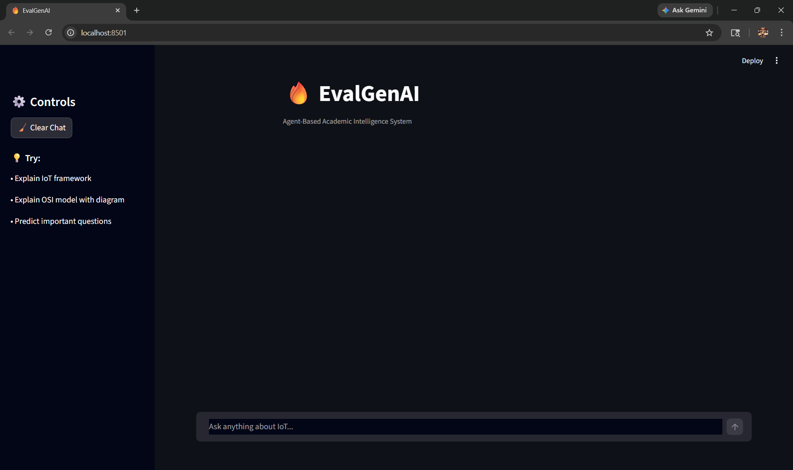
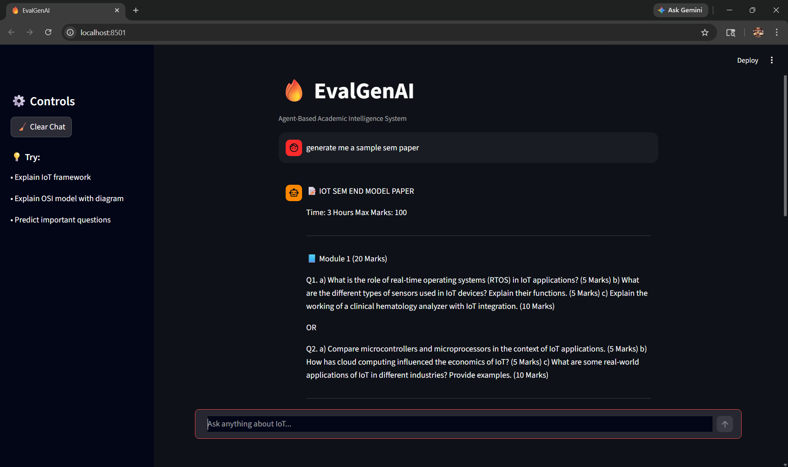

# 🚀 EvalGenAI – AI-Powered Academic Assistant

EvalGenAI is an intelligent academic assistant built using **Retrieval-Augmented Generation (RAG)** and **agent-based routing**, designed to help students:

- 📘 Get accurate answers from study materials
- 📝 Generate structured question papers
- 🎯 Retrieve module-specific content efficiently

---

## 🧠 Key Features

### 🔹 Dual RAG Pipelines
- **Answer RAG** → Generates answers from notes
- **Question Paper RAG** → Retrieves and generates exam papers

### 🔹 Agent-Based Routing
- Smart routing system decides:
  - Whether to answer a query
  - Or generate a question paper

### 🔹 Module-Aware Retrieval
- Filters content based on subject modules
- Improves relevance of responses

### 🔹 Question Paper Generation
- Automatically generates structured exam papers
- Supports different formats and modules

---

## 🏗️ System Architecture

User Query
↓
Agent Router
↓
┌───────────────┬────────────────┐
↓ ↓
Answer RAG QP RAG
(Retrieve + Generate) (Retrieve + Generate)
↓ ↓
Final Response / Question Paper

---

## 📂 Project Structure

EvalGenAI/
│
├── RAG/
│ ├── answer_rag/
│ │ ├── retrieve.py
│ │
│ ├── qp_rag/
│ │ ├── generate_paper.py
│ │ ├── generate_sem_paper.py
│ │ ├── ingest_qp.py
│ │ ├── retrieve_qp.py
│
├── agent/
│ ├── router.py
│
├── data/
│ ├── iot/
│ │ ├── mod1/
│ │ ├── mod2/
│ │ └── ...
│
├── .gitignore
└── README.md

---

## ⚙️ Tech Stack

- **Python**
- **LLMs (OpenAI / compatible APIs)**
- **Vector Databases (for RAG)**
- **Embedding Models**
- **Custom Agent Routing Logic**

---

## 🚀 How It Works

1. User enters a query
2. Router determines intent:
   - Answer question
   - Generate question paper
3. Relevant RAG pipeline is triggered
4. System retrieves context
5. LLM generates final output

---

## 🧪 Example Use Cases

- “Explain IoT architecture” → Answer RAG
- “Generate Module 3 question paper” → QP RAG
- “Give 10-mark questions from Module 5” → Structured generation

---

## 📸 Screenshots

> Add your UI / output screenshots below

### 🔹 Chat Interface

### 🔹 Generated Question Paper

### 🔹 Retrieval / Output Example

---

## ⚠️ Current Limitations

- Retrieval accuracy can be improved
- Module filtering still being refined
- No formal evaluation metrics yet
- UI layer under development

---

## 🔮 Future Improvements

- Hybrid search (BM25 + embeddings)
- Reranking for better retrieval
- Evaluation system for accuracy tracking
- Interactive frontend (ChatGPT-like UI)
- Deployment as a web application

---

## 🧑‍💻 Author

**Sumanth Simha**

Focused on building **AI systems that solve real-world problems** using:
- Machine Learning
- RAG Architectures
- Agent-Based Systems

---

## ⭐ Final Note

This project demonstrates the design and implementation of a **multi-pipeline AI syste
